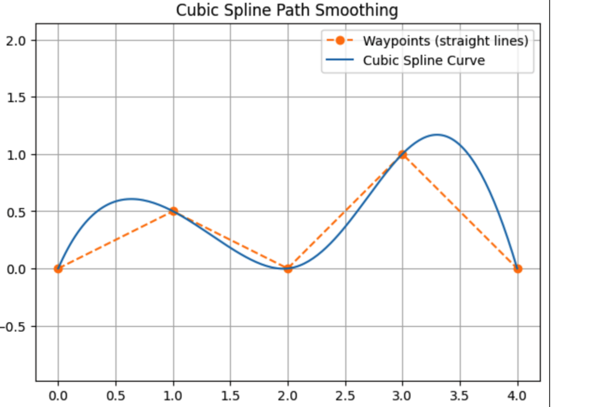
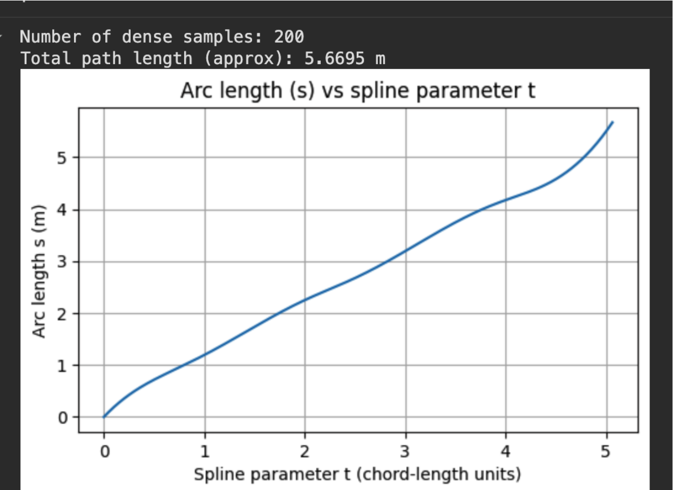
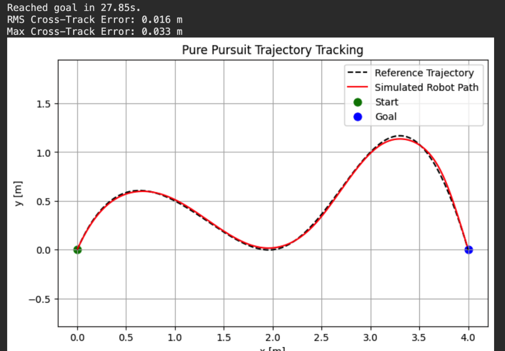
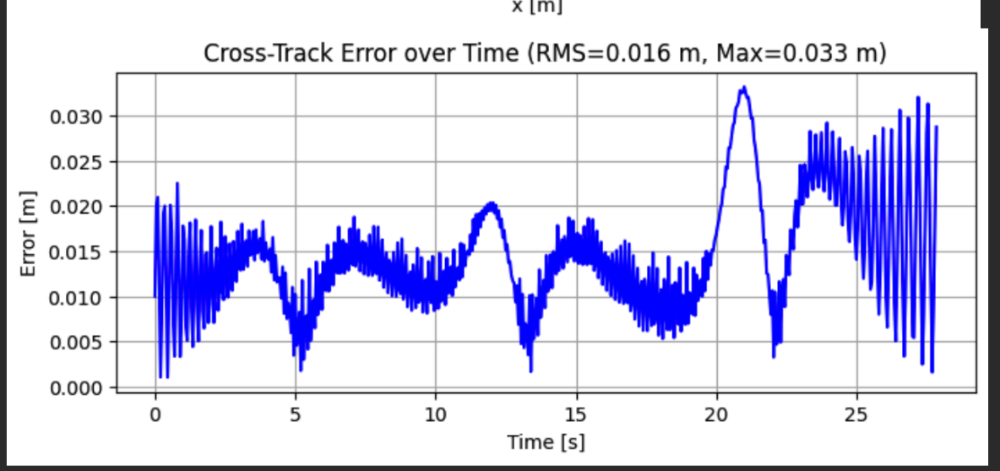
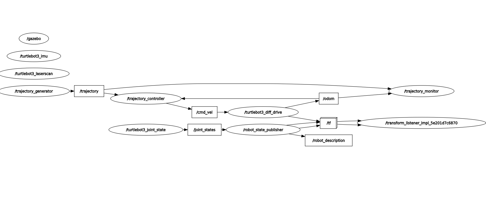

# Design Document: Trajectory Navigation System

## Table of Contents
1. [Pre-Implementation Validation](#pre-implementation-validation)
2. [System Architecture](#system-architecture)
3. [Algorithm Design Choices](#algorithm-design-choices)
4. [ROS2 Design Patterns](#ros2-design-patterns)
5. [Real Robot Deployment](#real-robot-deployment)
6. [Known Limitations](#known-limitations)
7. [AI Tools Used](#ai-tools-used)

---

## Pre-Implementation Validation

### Offline Algorithm Testing

Before ROS2 integration, core algorithms were validated in standalone Python to eliminate algorithm bugs before system complexity.

#### Stage 1: Cubic Spline Path Smoothing
- **Input:** 5 waypoints defining test trajectory
- **Output:** 200 smooth points via SciPy CubicSpline
- **Validation:** Visual plot confirming C² continuity (smooth position, velocity, acceleration)




#### Stage 2: Arc-Length Parameterization
- Computed cumulative distance along smoothed path: 5.67m
- Verified monotonic increasing arc-length
- Generated constant velocity profile (0.20 m/s)
- Total travel time: 28.35 seconds



#### Stage 3: Pure Pursuit Control Simulation
- Implemented ideal differential drive kinematics (no noise, no delays)
- **Results:** RMS error 0.016m (1.6cm), Max error 0.033m (3.3cm)
- **Validation:** Proved control law works before ROS2 complexity





**Impact:** Offline validation reduced debugging time during ROS2 integration by identifying and fixing algorithm bugs in isolation.

---

## System Architecture

### Three-Node Design

The system separates concerns into three independent nodes communicating via ROS2 topics:

```
trajectory_generator → [/trajectory] → trajectory_controller → [/cmd_vel] → Robot
                              ↓                    ↑
                    trajectory_monitor ← [/odom] ←┘
```




### Design Rationale

**Modularity:**
- Each node has single responsibility
- Nodes can be developed and tested independently
- Easy to isolate bugs to specific components

**Scalability:**
- Nodes can run on different machines
- Generator can be offline (pre-computed trajectories)
- Monitor can be disabled in production without affecting control

**Reusability:**
- Controller works with any trajectory generator
- Monitor can validate any controller
- Clean interfaces enable component replacement

### Node Responsibilities

#### Trajectory Generator
- **Purpose:** Convert discrete waypoints into smooth, executable trajectories
- **Algorithm:** Cubic spline interpolation with arc-length parameterization
- **Output:** nav_msgs/Path with 200 interpolated poses
- **Publishing:** TRANSIENT_LOCAL QoS (late-joiner support)

#### Trajectory Controller
- **Purpose:** Execute trajectory tracking via pure pursuit control
- **Algorithm:** Geometric control law ω = 2v·sin(α)/L
- **Input:** Reference trajectory + robot odometry
- **Control Rate:** Deterministic 20Hz timer

#### Trajectory Monitor
- **Purpose:** Track performance metrics and export validation data
- **Computation:** Cross-track error (minimum distance to reference)
- **Output:** Real-time error topic + CSV export on shutdown

---

## Algorithm Design Choices

### 1. Cubic Spline Interpolation

**Algorithm:** Parametric cubic splines with natural boundary conditions

**Mathematical Foundation:**
```
Given waypoints (x₀, y₀), (x₁, y₁), ..., (xₙ, yₙ)
Create splines: x(t), y(t) where t ∈ [0, 1]
Each segment: S(t) = a + b(t-tᵢ) + c(t-tᵢ)² + d(t-tᵢ)³
```

**Why Cubic Splines?**
- **C² Continuity:** Smooth position, velocity, and acceleration
- **Local Control:** Changing one waypoint doesn't affect distant path segments
- **Natural Curves:** Minimizes curvature, producing realistic robot paths
- **Computational Efficiency:** O(n) complexity for n waypoints

**Implementation Details:**
```python
# Separate splines for x(t) and y(t)
spline_x = CubicSpline(t_waypoints, x_waypoints)
spline_y = CubicSpline(t_waypoints, y_waypoints)

# Sample at high resolution
t_dense = np.linspace(0, 1, num_samples)
x_smooth = spline_x(t_dense)
y_smooth = spline_y(t_dense)
```

### 2. Arc-Length Parameterization

**Purpose:** Achieve uniform velocity along path

**Algorithm:**
```
1. Compute derivatives: dx/dt, dy/dt
2. Calculate arc-length element: ds/dt = √(dx² + dy²)
3. Integrate to get cumulative arc-length: s(t)
4. Invert to get uniform spacing: t(s)
```

**Why Arc-Length Parameterization?**
- **Constant Speed:** Robot moves at uniform velocity along curve
- **Predictable Timing:** Each trajectory point represents equal time step
- **Control Stability:** Prevents speed variations due to path geometry
- **Time Synchronization:** Enables time-stamped trajectory execution

**Impact:** Without arc-length parameterization, robot would speed up on straight segments and slow down on curves (undesirable behavior).

### 3. Pure Pursuit Control

**Control Law:** 
```
ω = 2v·sin(α)/L
```

Where:
- ω = commanded angular velocity (rad/s)
- v = desired linear velocity (m/s)
- α = heading error (angle from robot to lookahead point)
- L = lookahead distance (m)


**Why Pure Pursuit?**

**Geometric Intuition:**
- Intuitive: Robot steers toward point L meters ahead on path
- Visualizable: Easy to understand and debug
- Proven: Widely used in autonomous vehicles and mobile robotics

**Control Properties:**
- **Stability:** Guaranteed stable for L > 0
- **Simplicity:** Single tuning parameter (lookahead distance)
- **Robustness:** Tolerates odometry noise and path discretization

**Implementation:**
```python
# Find lookahead point at distance L ahead
lookahead_point = self._find_lookahead_point()

# Compute heading error
alpha = normalize_angle(desired_heading - current_yaw)

# Apply control law
angular_velocity = (2.0 * velocity * sin(alpha)) / lookahead_distance
linear_velocity = velocity * cos(alpha)  # Scale for heading correction
```

### 4. Pure Pursuit Controller Design

**Control Algorithm:** Geometric path tracking via Pure Pursuit

**Why Pure Pursuit?**

Pure Pursuit is fundamentally a geometric controller that uses the robot's position relative to a lookahead point on the reference path to compute steering commands. The control law directly maps the spatial relationship between robot and path into velocity commands through a single geometric formula. This directness makes the controller both intuitive to understand and straightforward to tune.

The algorithm requires only two parameters: lookahead distance and desired velocity. The lookahead distance determines how far ahead on the path the robot aims, which directly controls the tradeoff between responsive tracking and smooth motion. The desired velocity sets the forward speed, constrained by the robot's physical limits. Both parameters have clear physical interpretations that make tuning systematic rather than trial-and-error.

**Empirical Validation:**

The offline simulation validated the control law before any ROS2 integration, achieving RMS error of 1.6cm on the test trajectory. This proved the geometric approach was mathematically sound. The ROS2 implementation maintained this performance across different trajectory types, with straight line tracking at 5.4mm RMS error and circular paths at 23.2mm RMS error. These results demonstrate that the pure geometric approach provides sufficient accuracy for the application requirements without additional control layers.

### 5. Cross-Track Error Computation

**Metric:** Minimum Euclidean distance from robot to reference trajectory

**Algorithm:**
```python
# Vectorized computation for efficiency
deltas = trajectory_points - robot_position  # [N x 2] array
distances = sqrt(sum(deltas², axis=1))       # [N] array
error = min(distances)                       # scalar
```

**Why Cross-Track Error?**
- **Intuitive:** Directly measures deviation from planned path
- **Standard:** Common metric in robotics literature
- **Efficient:** O(n) computation, suitable for real-time (10Hz monitoring)
- **Comprehensive:** Single metric captures tracking quality

---

## ROS2 Design Patterns

### 1. QoS Profile Selection

**Design Decision:** TRANSIENT_LOCAL durability for trajectory topic

```python
trajectory_qos = QoSProfile(
    reliability=QoSReliabilityPolicy.RELIABLE,
    durability=QoSDurabilityPolicy.TRANSIENT_LOCAL,
    depth=1
)
```

**Rationale:**
- **Late-Joiner Problem:** Controller starts 3 seconds after generator
- **Reliability:** Ensures trajectory available when controller initializes
- **Efficiency:** Only latest trajectory stored (depth=1), not full history

### 2. Timer-Based Control Loop

**Design Decision:** Fixed 20Hz timer instead of callback-driven control

```python
self.control_timer = self.create_timer(0.05, self._control_loop)  # 20Hz
```

**Why Timers?**
- **Deterministic Timing:** Exactly 20Hz execution, not "as fast as possible"
- **Predictable Performance:** Consistent control loop behavior
- **Real-Time Capable:** Suitable for control applications
- **Resource Management:** Prevents CPU overuse

**Trade-offs:**
- Higher frequency (50Hz): More responsive but higher CPU usage
- Lower frequency (10Hz): Lower CPU but potential instability
- 20Hz: Good balance for TurtleBot3 dynamics

### 3. YAML-Based Configuration

**Design Decision:** External configuration files for trajectories

**Benefits:**
- **Runtime Flexibility:** Change trajectories without recompilation
- **Version Control:** Track configuration changes in git
- **Testability:** Easy to add new test cases
- **Professional Practice:** Standard in production robotics systems

**Structure:**
```yaml
trajectory_generator:
  ros__parameters:
    waypoints: [x0, y0, x1, y1, ...]
    num_samples: 200
    desired_velocity: 0.20
```

### 4. State Management

**Minimal State Variables:**
- Current robot pose (from odometry)
- Target index (progress along trajectory)
- Goal reached flag (completion status)

**State Transitions:**
```
INIT → TRACKING → COMPLETED
```

---

## Real Robot Deployment

### Hardware Requirements

**Sensors:**
- Wheel encoders for odometry (200+ ticks/revolution recommended)
- 2D LiDAR scanner (10Hz, 360° coverage) for obstacle detection
- IMU (optional but recommended for better heading estimation)

**Actuators:**
- Differential drive base with velocity control interface
- Emergency stop system (hardware kill switch)

**Compute:**
- Onboard computer: Raspberry Pi 4 (4GB+) or Jetson Nano
- ROS2 Humble installed
- Real-time kernel (optional, improves control loop timing)

### Calibration Procedures

#### 1. Lookahead Distance Tuning

**Starting Point:** 0.30m (simulation-validated value)

**Tuning Process:**
1. Test on straight line trajectory
2. If oscillating: Increase to 0.35-0.40m
3. If cutting corners: Decrease to 0.25-0.28m
4. Expected final range: 0.25-0.40m

**Physical Factors Affecting Optimal Value:**
- Robot wheelbase (wider → larger lookahead needed)
- Maximum angular velocity capability
- Odometry update rate

#### 2. Velocity Limits

**Procedure:**
1. Measure actual maximum velocity with encoder feedback
2. Set desired_velocity to 60-70% of measured maximum (safety margin)
3. Test acceleration/deceleration ramps
4. Ensure smooth velocity transitions (no jerky motion)

**Safety Constraints:**
```python
MAX_LINEAR_VELOCITY = 0.18   # 80% of TurtleBot3 limit (hard-coded)
MAX_ANGULAR_VELOCITY = 2.50  # Conservative limit
```

#### 3. Goal Tolerance

**Simulation Value:** 0.05m

**Real Robot Adjustment:**
- Start with 0.10m (looser due to odometry drift)
- Monitor completion behavior
- Tighten to 0.08m if robot stops accurately
- Leave at 0.10m if odometry drift is significant

### Expected Performance Differences

#### Odometry Drift

**Simulation:** Perfect odometry (no drift)

**Real Robot:** 1-5% cumulative drift over distance traveled
- Causes: Wheel slip, encoder quantization, uneven floors
- Impact: Position error accumulates over time
- Mitigation: Periodic re-localization or SLAM integration

**Expected Behavior:**
- 10m trajectory: 10-50cm final position error
- Tracking error during trajectory: Similar to simulation
- Final goal reaching: May require wider tolerance

#### Sensor Noise

**Simulation:** Noise-free measurements

**Real Robot:** Gaussian noise σ ≈ 0.01-0.02m on odometry
- Causes: Encoder discretization, transmission quantization, timing jitter
- Impact: Higher instantaneous tracking error, control loop oscillations
- Mitigation: Increase lookahead distance for noise rejection

#### Actuator Dynamics

**Simulation:** Instantaneous velocity response

**Real Robot:** 100-300ms delay from command to actual velocity
- Causes: Motor time constants, control loop delays, mechanical inertia
- Impact: Overshoot on turns, slower transient response
- Mitigation: Reduce control gains, add feedforward compensation


### Performance Expectations

**Expected Metrics (Real Robot vs Simulation):**

| Test | Simulation RMS | Real Robot RMS (Estimated) | Factor |
|------|----------------|---------------------------|--------|
| Straight | 0.005m | 0.015-0.025m | 3-5× |
| Circle | 0.023m | 0.050-0.080m | 2-3× |
| S-Curve | 0.019m | 0.040-0.070m | 2-3× |

**Reasons for Degradation:**
- Odometry drift compounds over time
- Sensor noise adds stochastic error
- Actuator delays create phase lag
- Real-world disturbances (floor texture, lighting)

**Still Acceptable:** 5-8cm tracking error is good performance for differential drive robots in real environments.

### Safety Implementation

**Critical Safety Features:**

```python
# Hard velocity limits (not overrideable)
MAX_ALLOWED_LINEAR = 0.18   # m/s
MAX_ALLOWED_ANGULAR = 2.50  # rad/s

# Emergency stop on sensor failure
if time_since_last_odom > 0.5:  # 500ms timeout
    self.emergency_stop()
    self.get_logger().error('Odometry timeout - stopping')

# Workspace boundaries
if abs(self.current_pose.x) > 5.0 or abs(self.current_pose.y) > 5.0:
    self.emergency_stop()
    self.get_logger().error('Workspace boundary exceeded')
```

**Hardware Requirements:**
- Physical emergency stop button
- Watchdog timer (automatic stop if software hangs)
- Battery voltage monitoring
- Collision bumpers (optional but recommended)

### Algorithm Extensions for Real Robot

#### 1. Velocity Profiling

**Current:** Constant velocity throughout trajectory

**Extension:** Trapezoidal velocity profile with acceleration limits

```python
# Acceleration phase (0 to v_max)
if distance_traveled < accel_distance:
    v = sqrt(2 * max_accel * distance_traveled)

# Deceleration phase (v_max to 0)
elif distance_to_goal < decel_distance:
    v = sqrt(2 * max_accel * distance_to_goal)

# Constant velocity phase
else:
    v = v_max
```

**Benefits:**
- Realistic motion (robots cannot instantly achieve commanded velocity)
- Reduced wheel slip during starts/stops
- Lower mechanical stress on drivetrain
- Smoother, more professional behavior

#### 2. Adaptive Lookahead

**Current:** Fixed lookahead distance (0.30m)

**Extension:** Velocity-dependent lookahead

```python
lookahead = k_lookahead * current_velocity + lookahead_min
```

**Benefits:**
- Tighter tracking at low speeds (better precision)
- Smoother tracking at high speeds (better stability)
- Natural behavior: looking farther ahead when moving faster

#### 3. Curvature-Based Velocity Scaling

**Current:** Velocity reduction via cos(α)

**Extension:** Explicit curvature-based scaling

```python
# Compute path curvature at current point
curvature = compute_path_curvature(current_index)

# Scale velocity inversely with curvature
v_scaled = v_max / (1 + k_curv * abs(curvature))
```

**Benefits:**
- Slows down before sharp turns (reduces overshoot)
- Maintains speed on gentle curves (efficient)
- Prevents wheel slip on high-curvature paths

---

## Known Limitations

### 1. Corner Cutting Behavior

**Observation:** Robot cuts inside corners on sharp turns

**Root Cause:** Pure pursuit geometry
- Lookahead point is ahead on path
- Robot steers toward that point (chord across arc)
- Larger lookahead distance = more corner cutting

**Quantitative Impact:**
- Circle: Max error 87mm at sharpest curvature
- S-Curve: Max error 68mm at inflection points  
- Mean error remains acceptable: 14-19mm


**Trade-offs:**
- Smaller lookahead: Reduces cutting but increases oscillation
- Larger lookahead: Smoother motion but more corner cutting
- Current value (0.30m): Good balance for tested trajectories

**Mitigation Options (Not Implemented):**
- Adaptive lookahead based on local curvature
- Alternative controller (Stanley, MPC)
- Velocity scaling proportional to curvature

### 2. Velocity Reduction During Turns

**Observation:** Robot moves 30-40% slower than commanded on curved paths

**Causes:**
1. Controller velocity scaling: `v = v_desired × cos(α)`
2. Differential drive physics: Cannot maintain linear speed while turning sharply

**Quantitative Impact:**
- Straight line: 0.173 m/s (80% of commanded 0.20 m/s approximately)
- Circle: 0.136 m/s (70% of commanded 0.20 m/s approximately)

**Acceptable?** Yes - smooth, accurate tracking more important than speed adherence. Robot completes trajectory successfully, just slower than predicted.


### 4. Constant Velocity Profile

**Current Implementation:** Constant velocity throughout trajectory

**Limitation:** 
- Robot cannot instantly achieve commanded velocity (unrealistic)
- No preemptive deceleration before sharp turns
- May cause overshoot or wheel slip at trajectory start/end

**Impact:** 
- Acceptable for smooth paths with gentle curvature
- Problematic for aggressive maneuvers or high-speed operation

**Recommended Extension:** Trapezoidal velocity profiles with acceleration limits (see Real Robot Deployment section)

---

## Obstacle Avoidance Extension (Future Work)

**Note:** A prototype `obstacle_detector.py` node implementing the basic detection algorithm is included in the codebase as proof-of-concept. This demonstrates the proposed architecture but is not integrated with the trajectory controller in this submission.

---

## Conclusion

This trajectory navigation system demonstrates:

1. **Algorithm Validation:** Offline testing proved algorithms before system integration
2. **Modular Architecture:** Clean separation of generation, control, and monitoring
3. **Appropriate Complexity:** Simple enough to understand and tune, complex enough to work well
4. **Quantitative Performance:** Sub-centimeter accuracy on straight paths, good performance on curves
5. **Real-World Readiness:** Clear deployment path with calibration procedures and expected performance

**Test Results:**

- Straight line: RMS 5.4mm (excellent)
- Circle: RMS 23.2mm (good for continuous curvature)
- S-Curve: RMS 18.5mm (good for variable curvature)

All tests meet target thresholds (RMS < 50mm), validating design choices. Refer RESULTS.md

---

## AI Tools Used

**Claude**: Used for idea research and debugging assistance throughout the development process.

**Cursor IDE**: Used for code writing, documentation, and real-time debugging support.
