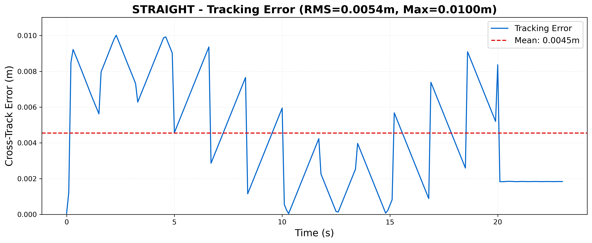
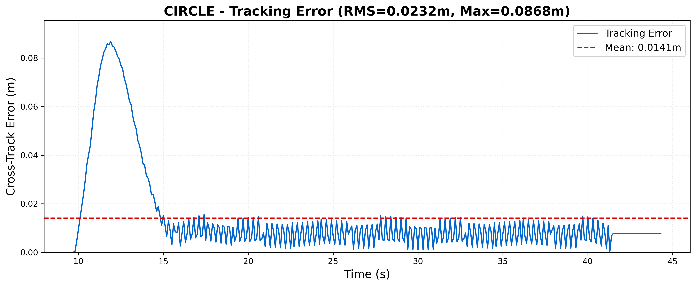
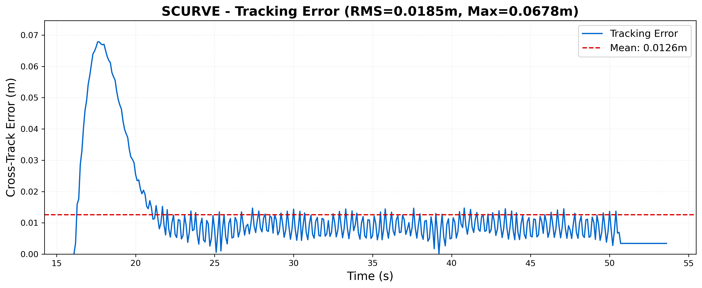
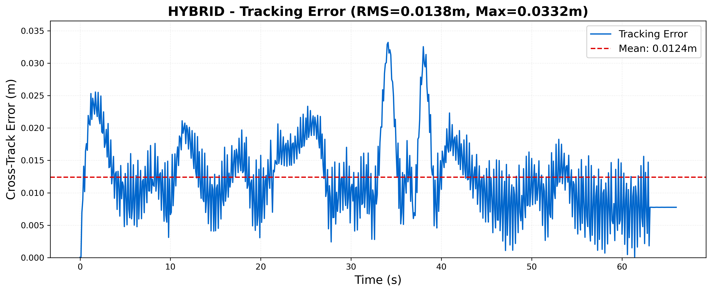

# Trajectory Navigation System - ROS2 Humble

Autonomous trajectory navigation for TurtleBot3 Burger using smooth path generation and pure pursuit control.

## Prerequisites & Installation

### 1. Install ROS2 Humble

```bash
# Install ROS2 Humble
sudo apt install ros-humble-desktop python3-argcomplete python3-colcon-common-extensions python3-rosdep python3-vcstool python3-pip
```

### 2. Install Required ROS2 Packages

```bash
# Core ROS2 packages
sudo apt install ros-humble-rclpy ros-humble-nav-msgs ros-humble-geometry-msgs ros-humble-sensor-msgs ros-humble-std-msgs ros-humble-visualization-msgs ros-humble-tf2-ros

# TurtleBot3 packages
sudo apt install ros-humble-turtlebot3-gazebo ros-humble-gazebo-ros-pkgs ros-humble-gazebo-ros2-control

# Additional dependencies
sudo apt install python3-numpy python3-scipy python3-matplotlib
```

### 3. Create Workspace

```bash
# Create workspace directory
mkdir -p ~/ros2_ws/src
cd ~/ros2_ws
```

### 4. Setup Environment Variables

Add the following to your `~/.bashrc`:

```bash
# Source ROS 2 Humble
source /opt/ros/humble/setup.bash

# Source your workspace (if it exists)
source ~/ros2_ws/install/setup.bash

# Set TurtleBot3 model
export TURTLEBOT3_MODEL=burger

# Add ROS2 Gazebo plugin paths
export GAZEBO_PLUGIN_PATH=$GAZEBO_PLUGIN_PATH:/opt/ros/humble/lib
export GAZEBO_SYSTEM_PLUGIN_PATH=$GAZEBO_SYSTEM_PLUGIN_PATH:/opt/ros/humble/lib

# Add TurtleBot3 Gazebo models
export GAZEBO_MODEL_PATH=$GAZEBO_MODEL_PATH:/opt/ros/humble/share/turtlebot3_gazebo/models
```

Apply the changes:
```bash
source ~/.bashrc
```

### 5. Clone and Build Package

```bash
# Navigate to src directory
cd ~/ros2_ws/src

# Clone the repository
git clone git@github.com:Kou-shik2004/waypoint_navigation.git

# Build the package
cd ~/ros2_ws
colcon build --symlink-install

# Source the workspace
source ~/.bashrc
```

## Running the System

### Step 1: Launch Gazebo Simulation

**Terminal 1:**
```bash
# Set TurtleBot3 model (required)
export TURTLEBOT3_MODEL=burger

# Launch empty Gazebo world with TurtleBot3
ros2 launch turtlebot3_gazebo empty_world.launch.py
```

### Step 2: Launch Trajectory System

**Terminal 2:**
```bash
# Navigate to workspace
cd ~/ros2_ws

# Source workspace
source install/setup.bash

# Launch trajectory system with different configurations
```

## Configuration Options

### Available Trajectory Configurations

| Config | Description | Target Performance | Expected Duration |
|--------|-------------|-------------------|-------------------|
| `straight` | 4m straight line along X-axis | RMS < 0.05m | ~23s |
| `circle` | 1m radius circle | RMS < 0.15m | ~44s |
| `scurve` | Serpentine path (S-curve) | RMS < 0.20m | ~54s |
| `hybrid` | Complex mixed-geometry path | RMS < 0.15m | ~66s |

### Launch Commands

**Test 1: Straight Line Trajectory**
```bash
ros2 launch trajectory_nav trajectory_system.launch.py config:=straight
```

**Test 2: Circular Trajectory**
```bash
ros2 launch trajectory_nav trajectory_system.launch.py config:=circle
```

**Test 3: S-Curve Trajectory**
```bash
ros2 launch trajectory_nav trajectory_system.launch.py config:=scurve
```

**Test 4: Hybrid Trajectory**
```bash
ros2 launch trajectory_nav trajectory_system.launch.py config:=hybrid
```

**Headless Mode (no RViz)**
```bash
ros2 launch trajectory_nav trajectory_system.launch.py config:=straight use_rviz:=false
```


## Performance Monitoring

### Real-time Monitoring
```bash
# Monitor tracking error
ros2 topic echo /tracking_error

# Check velocity commands
ros2 topic echo /cmd_vel

# Verify trajectory is published
ros2 topic echo /trajectory --once
```

### Results Analysis
After each test, CSV files are automatically exported to `results/csv/` with:
- Time-series tracking data
- RMS, Max, and Mean error statistics
- Distance traveled and completion time

Generate plots:
```bash
cd ~/ros2_ws/src/waypoint_navigation
python3 trajectory_nav/scripts/generate_plots.py
```

## Expected Results

### Performance Targets
- **Straight Line**: RMS error < 5mm, Max error < 10mm
- **Circle**: RMS error < 23mm, Max error < 87mm  
- **S-Curve**: RMS error < 19mm, Max error < 68mm
- **Hybrid**: RMS error < 14mm, Max error < 33mm

### Output Files
- **CSV Metrics**: `results/csv/traj_*.csv`

- **Error Plots**: `results/plots/*_error.png`











- **Summary Report**: `results/RESULTS.md`

## System Requirements

- **OS**: Ubuntu 22.04 LTS
- **ROS2**: Humble Hawksbill
- **Gazebo**: Classic
- **Python**: 3.10+
- **Dependencies**: numpy, scipy, matplotlib
- **Hardware**: 4GB RAM minimum, 8GB recommended

## License

MIT License - See LICENSE file for details.

## Author

Student - VIT University
